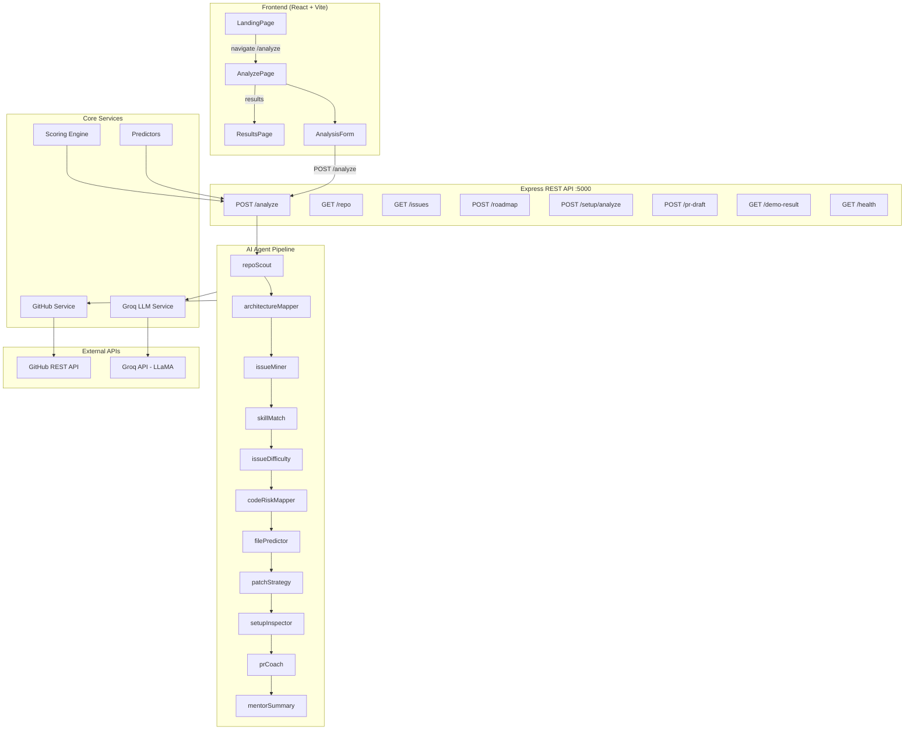
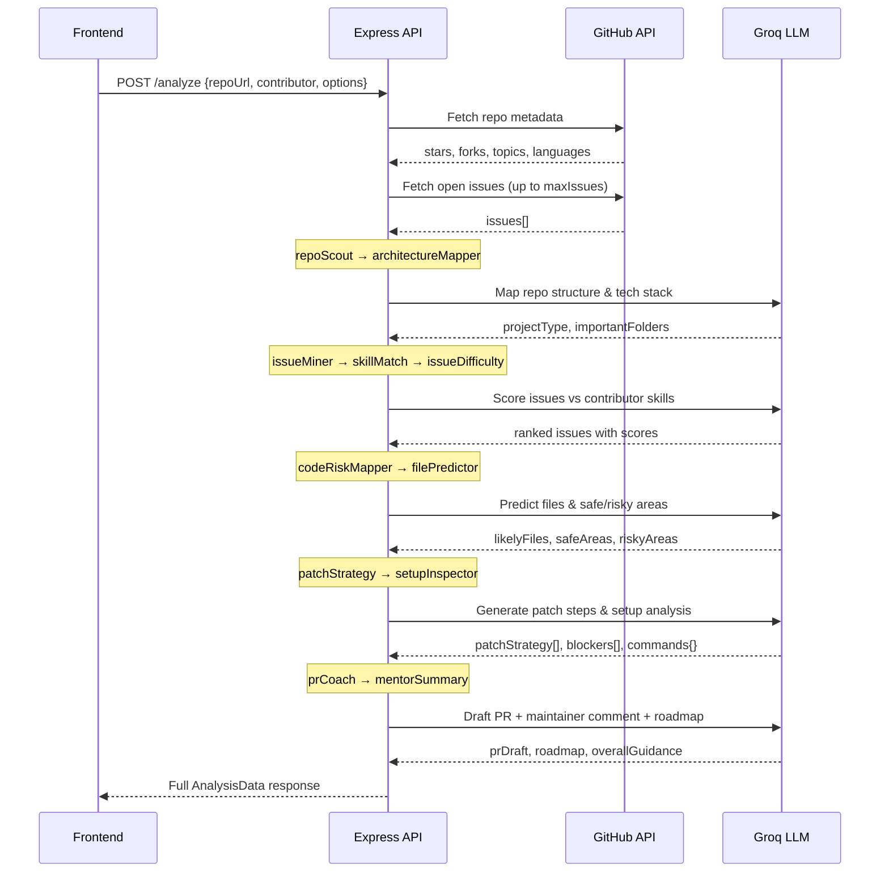
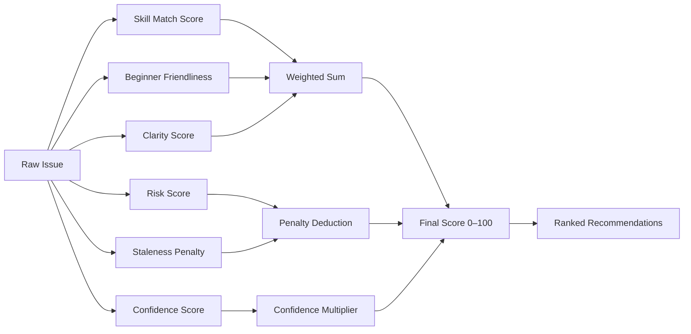

# OpenPath

> **Agentic open-source mentor** — paste a GitHub repo, describe your skills, and get a personalized contribution roadmap in seconds.

OpenPath analyzes public GitHub repositories through a pipeline of specialized AI agents, scores open issues against your skill profile, and produces a step-by-step guide to your first pull request — including setup instructions, likely files to touch, patch strategy, and a ready-to-send maintainer comment.

---

## Table of Contents

- [Features](#features)
- [Architecture](#architecture)
- [Agent Pipeline](#agent-pipeline)
- [API Reference](#api-reference)
- [Tech Stack](#tech-stack)
- [Project Structure](#project-structure)
- [Getting Started](#getting-started)
- [Environment Variables](#environment-variables)
- [Contributing](#contributing)

---

## Features

- **Repo Intelligence** — fetches metadata, detects primary language, topics, stars, and forks via GitHub API
- **Issue Mining** — pulls open issues and filters them through 11 specialized AI agents
- **Skill Matching** — scores each issue against your skill set (beginner / intermediate / advanced)
- **AI Roadmap** — step-by-step contribution plan generated by Groq LLM
- **Setup Analyzer** — detects install commands, env requirements, and setup blockers
- **PR Draft** — generates a PR title, description, and a copy-paste maintainer comment
- **File Predictor** — predicts which files you'll likely need to touch
- **Risk Mapping** — flags safe areas vs. risky areas of the codebase
- **Custom Skills** — add any skill beyond the preset list

---

## Architecture



---

## Agent Pipeline

Each analysis request flows through 11 specialized agents in sequence:



---

## Scoring Engine

Issues are ranked by a multi-factor scoring model:



---

## API Reference

| Method | Endpoint | Description |
|--------|----------|-------------|
| `GET` | `/api/health` | Server health check |
| `POST` | `/api/analyze` | Full repo analysis (main endpoint) |
| `GET` | `/api/repo` | Fetch repository metadata only |
| `GET` | `/api/issues` | Fetch open issues only |
| `POST` | `/api/issues/score` | Score issues against a contributor profile |
| `POST` | `/api/setup/analyze` | Analyze setup requirements |
| `POST` | `/api/roadmap` | Generate contribution roadmap |
| `POST` | `/api/pr-draft` | Generate PR draft & maintainer comment |
| `GET` | `/api/demo-result` | Return mock analysis result |

### POST `/api/analyze` — Request Body

```json
{
  "repoUrl": "https://github.com/owner/repo",
  "contributor": {
    "level": "beginner",
    "skills": ["React", "TypeScript", "CSS"],
    "goal": "first-pr",
    "preferredContributionType": "code"
  },
  "options": {
    "maxIssues": 20,
    "includeAiRoadmap": true,
    "includePrDraft": true,
    "includeSetupAnalysis": true
  }
}
```

**`contributor.level`** — `beginner` | `intermediate` | `advanced`  
**`contributor.goal`** — `first-pr` | `bug-fix` | `docs` | `feature` | `testing` | `explore`  
**`contributor.preferredContributionType`** — `code` | `docs` | `testing` | `ui` | `backend` | `any`

---

## Tech Stack

| Layer | Technology |
|-------|-----------|
| Frontend | React 18, TypeScript, Vite |
| Styling | Tailwind CSS, clsx |
| Icons | lucide-react |
| Routing | react-router-dom v7 |
| Backend | Node.js ≥ 18, Express 4 (ES Modules) |
| AI / LLM | Groq SDK (LLaMA models) |
| GitHub data | Axios + GitHub REST API v3 |
| Dev tools | nodemon, Vite HMR |

---

## Project Structure

```
OpenPath/
├── client/                   # React frontend
│   ├── public/
│   │   └── logo.svg
│   ├── src/
│   │   ├── api/              # openpath.ts — API client
│   │   ├── components/       # Shared UI components
│   │   │   ├── AnalysisForm.tsx
│   │   │   ├── IssueCard.tsx
│   │   │   ├── RoadmapCard.tsx
│   │   │   ├── PRDraftCard.tsx
│   │   │   ├── SetupCard.tsx
│   │   │   ├── RepoHeader.tsx
│   │   │   ├── NavBar.tsx
│   │   │   └── Footer.tsx
│   │   ├── pages/
│   │   │   ├── LandingPage.tsx   # Hero / marketing
│   │   │   ├── AnalyzePage.tsx   # Form + analysis flow
│   │   │   └── ResultsPage.tsx   # Results display
│   │   ├── types/            # Shared TypeScript types
│   │   ├── App.tsx           # Router setup
│   │   ├── main.tsx
│   │   └── index.css         # Tailwind + design tokens
│   ├── .env                  # VITE_API_BASE_URL
│   └── vite.config.ts
│
└── server/                   # Express backend
    ├── server.js             # Entry point
    └── src/
        ├── controllers/      # Route handlers
        ├── routes/           # Express routers
        ├── services/
        │   ├── agents/       # 11 AI agents
        │   │   ├── repoScout.agent.js
        │   │   ├── architectureMapper.agent.js
        │   │   ├── issueMiner.agent.js
        │   │   ├── skillMatch.agent.js
        │   │   ├── issueDifficulty.agent.js
        │   │   ├── codeRiskMapper.agent.js
        │   │   ├── filePredictor.agent.js  (via predictors/)
        │   │   ├── patchStrategy.agent.js
        │   │   ├── setupInspector.agent.js
        │   │   ├── prCoach.agent.js
        │   │   └── mentorSummary.agent.js
        │   ├── scoring/      # Modular scoring services
        │   │   ├── issueScoring.service.js
        │   │   ├── riskScoring.service.js
        │   │   ├── confidenceScoring.service.js
        │   │   └── stalenessScoring.service.js
        │   ├── predictors/   # File & stack detection
        │   │   ├── filePredictor.service.js
        │   │   ├── stackDetector.service.js
        │   │   └── setupCommandDetector.service.js
        │   ├── github.service.js
        │   ├── groq.service.js
        │   ├── ai.service.js
        │   ├── scoring.service.js
        │   ├── roadmap.service.js
        │   ├── prDraft.service.js
        │   └── setupAnalyzer.service.js
        ├── prompts/          # LLM prompt templates
        └── data/             # Static / demo data
```

---

## Getting Started

### Prerequisites

- Node.js ≥ 18
- A [Groq API key](https://console.groq.com/)
- A GitHub Personal Access Token (for higher rate limits)

### 1. Clone the repository

```bash
git clone https://github.com/your-username/OpenPath.git
cd OpenPath
```

### 2. Set up the backend

```bash
cd server
npm install
cp .env.example .env
# Fill in your API keys in .env
npm run dev       # starts on http://localhost:5000
```

### 3. Set up the frontend

```bash
cd client
npm install
# .env already has VITE_API_BASE_URL=http://localhost:5000/api
npm run dev       # starts on http://localhost:5173
```

Open [http://localhost:5173](http://localhost:5173) in your browser.

---

## Environment Variables

### `server/.env`

```env
PORT=5000
NODE_ENV=development

# Groq API (required for AI features)
GROQ_API_KEY=your_groq_api_key_here

# GitHub Token (optional but recommended — increases rate limit from 60 → 5000 req/hr)
GITHUB_TOKEN=your_github_token_here
```

### `client/.env`

```env
VITE_API_BASE_URL=http://localhost:5000/api
```

---

## Contributing

1. Fork the repository
2. Create a feature branch: `git checkout -b feat/your-feature`
3. Commit your changes: `git commit -m "feat: add your feature"`
4. Push to the branch: `git push origin feat/your-feature`
5. Open a pull request

---

## License

MIT
